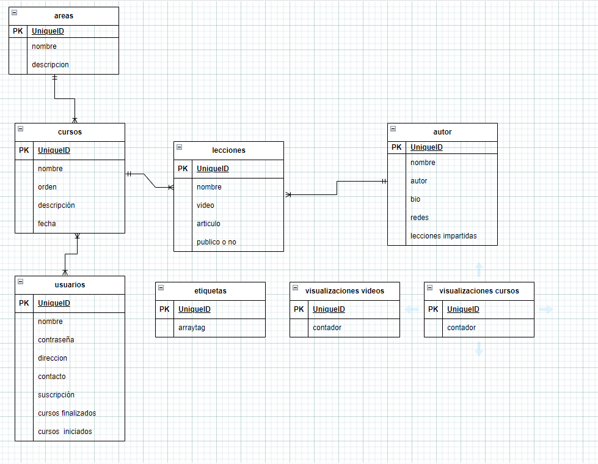
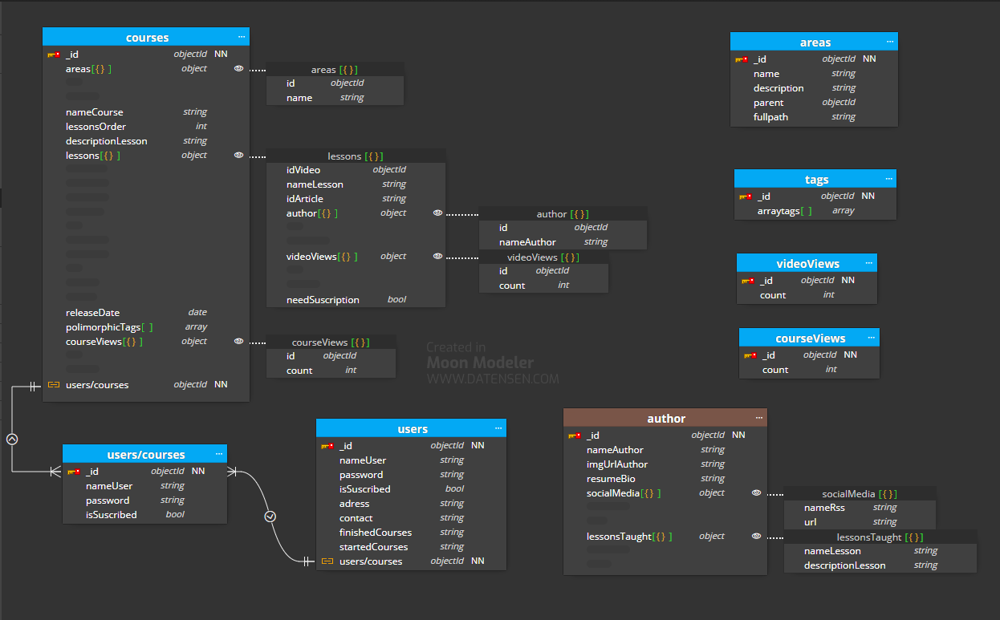

# 00-labmodel

## Caso opcional
---
Para este caso además del modelado anterior nos indica que las áreas de estudio van a tener una estructura jerárquica, va a tener videos públicos y privados a demanda de si están registrados o suscritos por lo cual va a haber usuarios y se quieren mostrar las visualizaciones que tienen los cursos y los videos.

1. Para la jerarquía creamos dentro de área una relación que apunte a sí misma y un campo de tipo string que recoja todo caminos,  en curso añadiremos un campo objeto de área con el nombre y el id duplicando así estos datos pero ganando en rendimiento.

2. La relación usuarios cursos es de N a N así que crearemos una tabla intermedia usuarios/cursos con relación 1 a N  y aplicamos un Extended Reference pattern para llevarnos los datos que más nos interesa de usuarios a usuarios/cursos mejorando el rendimiento al no tener que cargar todos los datos de usuarios. Uno de estos campos es de tipo booleano para comprobar si está suscrito, que de ser cierto le dará acceso a videos privados (otro booleano en la colección de lecciones).

3. Para los tags he creado una colección que contiene un array de objetos que serán las etiquetas que nosotros queramos con diferentes categorías y mediante un Polymorphic pattern añadimos esta colección a cursos.

4. Tanto para las visualizaciones de videos como de cursos usamos Computed Pattern así calcularemos el número de visualizaciones sin malgastar ciclos de CPU ya que se trata de un cálculo repetitivo.

5. Como se esperan diversas ampliaciones en los siguientes años podríamos añadir un Schema Versioning Pattern en cursos que es nuestra colección que recibe más lecturas en caso de que necesite actualizarse.

Con todo aplicado en Moon Modeler nos quedaria así:

