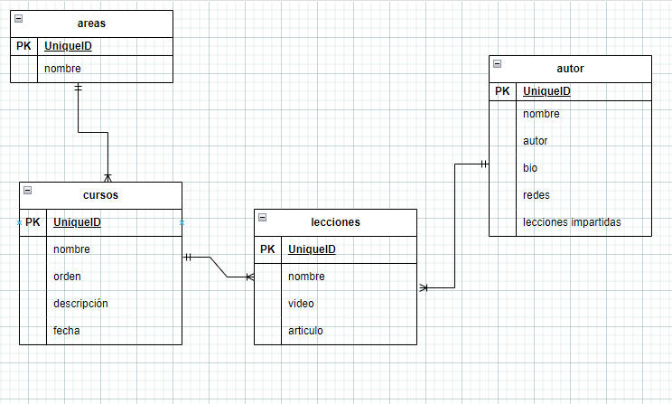
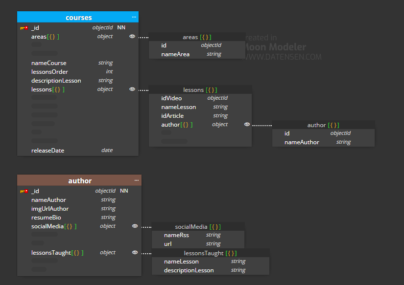
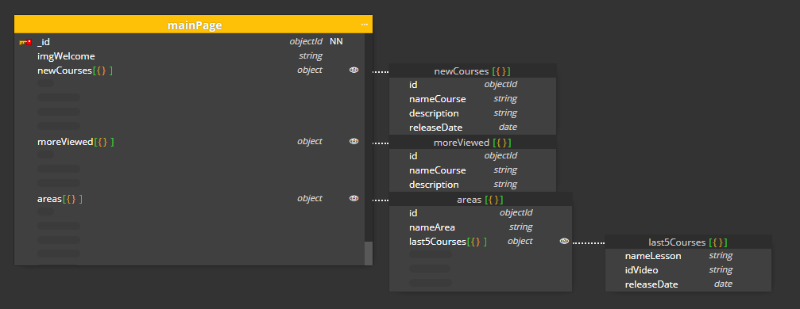

# 00-labmodel

## Caso básico
---
Siendo el enunciado: una startup tecnológica va a desarrollar un portal de ELearning y nos ha pedido que realicemos el modelo de datos de dicho sistema.
A tener en cuenta:

Va a ser un portal orientado al mundo de la programación.
El portal va a estar compuesto por cursos, cada curso está compuesto a su vez por un número de vídeos y artículos que lo acompañen.

La página de cursos debe mostrar la lista de autores que lo hicieron.

La página de un vídeo debe mostrar el autor que lo realizó.

Los videos y el contenido de cada artículo se almacenan en un storage S3 y en un headless CMS, en la base de datos sólo almacenaremos los Id's a esos recursos.

Los videos se pueden clasificar por temáticas (Devops / Front End / Back End / ...)
Los videos tienen autores (ponemos la restricción, un video tiene un autor), un curso puede tener varios autores.

En principio los vídeos no se van a compartir entre diferentes cursos (aunque sería una aplicación interesante del ejercicio.

Hay una opción para ver la página con la biografía del autor, esta página no va a ser muy visitada.

---
Para la visualización de las colecciones y sus relaciones he realizado un diagrama entidad-relación añadiendo los campos más importantes (luego en Moon Modeler añadiremos los que podemos intuir en los mocks de la aplicación).

Las colecciones serian:

1. Áreas o temáticas: esta solo guarda el nombre al que pertenece los cursos y de momento solo son 4 por lo cual vamos a anidarlas a la colección cursos es decir en el lado de muchos. Se trata de un anidamiento seguro ya que no pasaremos de los 16Mb además de que podremos cargar los datos de cursos sin tener que cruzar esta colección.

2. Cursos: En principio solo hay 10 cursos y se espera que en un año sean 100 cursos indicándonos que de primera no guardará mucho espacio en la memoria.Esta será la colección más visitada y donde nos interesa que cargue toda la información primero es decir que esté precargada en la Working Set. 

    Como se espera que haya 1000 cursos en 5 años y se trata de la colección más visitada es probable que en esos 5 años se necesite hacer cambios a la colección pues podriamos aplicar el patrón de Schema Versioning por si fuera necesario una migración a otra version actualizada sin necesidad de pararla (la añado en el modelaje opcional).

3. Lecciones: en esta colección se guardan los videos y los artículos que forman cada curso, también sabemos que será una de las colecciones mas visitada y que necesitará estar precargada en la Working Set, es por ello que esta colección la insertamos en cursos por los mismos motivos que embebemos la coleccion areas y con la seguridad de que no sobrepasaremos los 16Mb de memoria ya que videos y artículos se guardan en una CDN y solo necesitamos una URL.

4. Autores: esta colección será la menos vista, guarda información sobre los autores. Aun así el enunciado nos pide que cada video muestre el nombre del autor es por ello que podemos aplicar un Extended Reference Pattern para unir el campo del nombre del autor a su lección. Duplicamos datos pero nos ahorra cargar toda la información del autor para cada video.

Una vez hecho esto y pasarlo a Moon Modeler añadiendo aquellos campos que podemos intuir en los mocks de la aplicación nos quedaría así:

La página principal la podemos delegar en el servidor web y que cacheara esta página o crearla a nivel de modelaje creando una colección que nos muestre como vemos en los mocks los cursos nuevos, los más vistos y los últimos 5 videos publicados de cada área:

